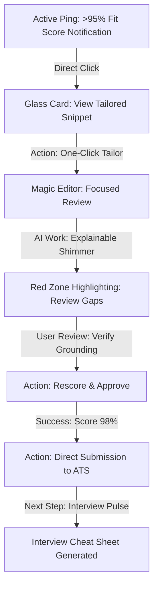

# UX Design Specification unkuff

**Author:** Venkatavamshigunji
**Date:** 2026-01-24

---

<!-- UX design content will be appended sequentially through collaborative workflow steps -->

## Executive Summary

### Project Vision

Unkuff is a "Career DevOps" platform designed to transform the job search from a manual, high-friction chore into a high-speed, automated pipeline. By centralizing a candidate's "Truth Source" (Master Profile) and using a Hybrid Ingestion Layer, the platform aims to reduce the time-to-apply from 45 minutes to under 5 minutes, ensuring >95% ATS suitability through iterative AI tailoring.

### Target Users

High-efficiency, tech-savvy professionals (e.g., Senior Data Scientists, Engineers) who value their time and are frustrated by the manual drudgery of traditional job boards. These users seek a reliable, data-driven "Success Pipeline" that offers transparency, confidence, and speed.

### Key Design Challenges

- **Orchestrating Wait Times:** Managing the UX for discovery and AI tailoring processes that can take 45+ seconds. Requires clear progress indicators, skeleton states, and background execution feedback to prevent a "frozen" feel.
- **Establishing Trust in the "Truth Anchor":** The system must visually prove that AI-generated resumes are grounded in the user's Master Profile. Transparency in "Keyword Gaps" and mapping results is critical for user confidence.
- **Kanban Information Density:** Displaying Suitability Scores, Source info, and status on a single Kanban card without creating visual clutter or "dashboard fatigue."

### Design Opportunities

- **The "Magic" Tailoring Experience:** Turning the ATS optimization process into a premium, cinematic-feeling automation that "wows" the user.
- **Interactive Success Pipeline:** Using the Kanban board to shift the user's emotional state from "job hunting stress" to "pipeline management satisfaction."

## Core User Experience

### Defining Experience

The core loop of unkuff revolves around the Kanban dashboard as the command center for career operations. The most frequent and critical action is the transition from discovering a "Recommended" job card to triggering the "Tailor" workflow. The experience is defined by the seamless synchronization between the Master Profile (the "Truth Source") and specific job requirements, resulting in an ATS-optimized resume without manual data entry.

### Platform Strategy

- **Desktop-First Web App:** Optimized for high-density information review and complex window management (Next.js/React).
- **Control Modalities:** Mouse-driven Kanban interactions with power-user keyboard shortcuts (e.g., `Cmd+Enter` for tailoring) to maintain application speed.
- **Mobile Responsive:** A "View-Only" status dashboard for tracking application progress and scores on the go.

### Effortless Interactions

- **Automatic Truth Grounding:** System-level detection of Master Profile gaps relative to high-match jobs.
- **Zero-Entry Tailoring:** Automated "Gap Fill" execution between Job Descriptions and the Master Profile, eliminating manual copy-pasting or formatting steps.

### Critical Success Moments

- **The "Green Light":** The moment a high-priority, dream role appears with a prominent, visually verified "98% Match" suitability score.
- **The "4-Minute Milestone":** Successfully completing an end-to-end application (discovery to download) in under 5 minutes for the first time.

### Experience Principles

- **Speed is the Ultimate Feature:** Every UI decision must prioritize reducing the time-to-apply to < 5 minutes.
- **Radical Transparency:** Visually demonstrate "the why" behind every score and AI modification to build trust.
- **Truth-First AI:** Strictly adhere to the Master Profile as the only source of truth, grounding all automation in authentic user data.
- **Pipeline Satisfaction:** Leverage interactive drag-and-drop and progress states to turn job hunting into a satisfying flow of accomplishments.

## Desired Emotional Response

### Primary Emotional Goals

The primary emotional objective for unkuff is **Sovereign Efficiency**—providing the user with the feeling of being the absolute master of their career pipeline with effortless speed. Users should feel **Empowered**, **In Control**, and **Confident** that their application quality is superior despite the drastic reduction in manual effort.

### Emotional Journey Mapping

- **Discovery:** Hope and Curiosity ("Could this actually work?").
- **Core Action (Tailoring):** Focused and Secure (The UI as a precision instrument).
- **Completion:** Triumph and Relief (The satisfaction of the "Applied" move).
- **Wait States:** Calm and Inforrmed (Trusting that the background "team" is performing deep work).

### Micro-Emotions

- **Trust:** Built through visible grounding of AI text to the Master Profile.
- **Accomplishment:** Driving the "click-and-drag" dopamine loop in the Kanban board.
- **Confidence vs. Anxiety:** Replacing the stress of uncertainty with data-verified suitability scores.

### Design Implications

- **Empowerment** → Low-latency interactions and powerful automation macros.
- **Trust** → "Source references" and transparent gap analysis visualizations.
- **Precision** → A professional, high-end "Pro" aesthetic with sharp typography and a structured, clean layout.

### Emotional Design Principles

- **Superpower Delivery:** Design every interaction to make the user feel faster and smarter than they could be alone.
- **Calm Professionalism:** Use a refined, uncluttered palette to reduce the inherent stress of job seeking.
- **Truth-Oriented Interactivity:** Use visual cues to verify that the AI is grounded in the user's authentic reality.

## UX Pattern Analysis & Inspiration

### Inspiring Products Analysis

- **LinkedIn & Indeed:** Leverages Machine Learning Relevance (MLR) hooks to surface curated jobs. We adopt this "Recommended for You" urgency while stripping social noise to focus on raw career data.
- **Google Docs:** Establishes the mental model for effortless editability and customization. Users expect a clean, low-friction way to polish their "Truth Source" and tailored resumes.
- **Pro Developer Tools (Linear/Vercel):** Inspires the "Command Center" aesthetic—dark-themed, high-contrast, and functionally sparse to minimize visual strain during intense workstations.

### Transferable UX Patterns

- **The "Fit Score" Hook:** A visual progress indicator showing semantic relevance (70% for transitions, 90%+ for direct matches). This builds instant user confidence and creates a "gamified" feedback loop during tailoring.
- **Grounding Sidebars:** Transparently showing *why* a score was given (e.g., "Matched on UX principles, gaps in Data Pipelines") to build trust in AI decisions.
- **Freshness Badging:** Highlighting "New in 24h" to emphasize the early-mover advantage (the "Early Bird Effect").
- **ATS Formatting Health:** A secondary "traffic light" indicators for technical resume accessibility (fonts, headers, parsability).

### Anti-Patterns to Avoid

- **The "Wall of Jobs":** Generic job boards that overwhelm with thousands of irrelevant roles; we counter this with a curated, scoped-down daily batch.
- **Opaque AI:** Avoid "black box" tailoring; the UI must always show the *delta* of what was changed and grounded in the Truth Source.
- **Decision Fatigue:** Preventing users from lurking by providing a clear "Green Light" on the best-fit roles.

### Design Inspiration Strategy

- **Adopt:** MLR-driven recommendation hooks; Dark-themed "Pro" aesthetic for reduced strain.
- **Adapt:** "Transition Fit Scores" for career pivoters; Real-time dynamic rescoring during editing.
- **Avoid:** Visual clutter or flashing banners; "Mobile-first" layouts that compromise the desktop workstation experience.

## Design System Foundation

### 1.1 Design System Choice

The project will utilize **Shadcn/ui** built on **Tailwind CSS** and **Radix UI** primitives. This foundation provides the perfect balance of accessible-first components and total visual flexibility.

### Rationale for Selection

Selected to achieve a high-conversion, professional "Pro" aesthetic (Dark Mode by default). This approach ensures:
- **Speed to Value:** Rapid deployment of complex Kanban and Dashboard components.
- **Maximum Customization:** Full control over design tokens to support the "Magical" tailoring UI.
- **Consistency:** Systematic application of accessible patterns using Radix primitives.

### Implementation Approach & Specialized Skills

To ensure world-class quality, agents must proactively orchestrate the following skills:

- **[.agent/skills/ui-ux-designer]:** Masters token-based architecture and accessibility. This skill will drive the atomic design system and ensure WCAG 2.1 AA compliance across the "Truth Source" editors.
- **[.agent/skills/full-stack-orchestration-full-stack-feature]:** Ensures API-first development. This will coordinate the handoff between the high-performance frontend and the complex AI/Ingestion backend services.
- **[.agent/skills/frontend-design]:** Focuses on visually stunning responsive layouts and micro-animations, specifically for the "Fit Score" and "Tailoring" feedback loops.

### Customization Strategy

- **Design Tokens:** Define a custom semantic palette (e.g., "Success Green" for high scores, "Alert Amber" for profile gaps) within the Tailwind configuration.
- **Professional Typography:** Utilize high-legibility, developer-centric typography (e.g., Inter or Geist) for clarity in high-density data views.
- **Accessibility-First:** Implement keyboard-navigable Kanban cards and screen-reader optimized progress indicators for long-running AI tasks.

## 2. Core User Experience

### 2.1 Defining Experience

The defining experience of unkuff is the **24-Hour Competitive Edge Loop**. Users describe it as a "career superpower"—identifying dream roles within hours of posting, verifying a high-fit score instantly, and having an ATS-optimized resume ready in under 5 minutes. The core interaction is the real-time "Rescoring" of a job card from a 70% transition score to a 95%+ tailored score, providing visual proof of application readiness.

### 2.2 User Mental Model

Users view unkuff not as a social network, but as an **AI-Powered Command Center**. They move away from the "fire and forget" anxiety of typical job boards and into a systematic "Pipeline Management" mindset. The Master Profile acts as their authentic "Truth Source," and the platform is the precision instrument used to project that truth into specific job markets.

### 2.3 Success Criteria

- **The "Early Bird" Win:** Successfully applying for a high-match role within its first 24 hours of visibility.
- **Loop Speed:** Total time from card discovery to resume download remains < 5 minutes.
- **Verifiable Trust:** User never questions an AI generation because the "Grounding Sidebar" clearly links every claim to their Master Profile.

### 2.4 Novel UX Patterns

- **Live Semantic Rescoring:** A dynamic UI element that updates as the AI tailors the resume, visually demonstrating the "value add" of the automation.
- **The Grounding Sidebar:** A novel side-drawer that provides a bridge between the AI's output and the user's authentic data, preventing the "AI Uncanny Valley" distrust.

### 2.5 Experience Mechanics

1. **Initiation:** User enters the dashboard to find a "New in 24h" card with a 70%+ initial Fit Score.
2. **Interaction:** User clicks "Tailor Resume"; the view shifts to a side-by-side "Magic Editor" showing the JD and the Truth Source.
3. **Feedback:** As the LLM processes, the Fit Score bar actively fills and changes color from Amber to Green. Grounding links appear as source markers.
4. **Completion:** The card receives a "Ready" badge; the user downloads the PDF and moves the card to "Applied" on the Kanban board.

## Visual Design Foundation

### Color System (Glass UI)
The project will utilize a premium **Glassmorphism (Liquid Glass)** aesthetic, inspired by Apple's visionOS and macOS Sonoma. This approach creates a sophisticated, multi-layered "Command Center" that balances depth with professional efficiency.
- **Base Material:** Dark Glass (30% opacity, 40px backdrop-blur) for primary cards and dashboard containers.
- **Surface Definition:** 1px subtle inner stroke (#ffffff1a) to define edges and mimic light refraction.
- **Vibrant Background:** A deep, atmospheric gradient of Midnight Blue (#020617) and Emerald-tinted Charcoal to provide a rich base for transparency effects.
- **Semantic Accents:** 
  - **High Performance:** Electric Blue (#3b82f6) for primary triggers.
  - **Success Match:** Emerald Green (#10b981) for the >90% Fit Score indicator.
  - **Transition Warning:** Vivid Amber (#f59e0b) to highlight keyword gaps.

### Typography System
- **Typeface Selection:** **Inter** (Variable) or **Geist** for their high-legibility, technical "Pro" aesthetic.
- **Vibrancy Labels:** Primary text will be pure white (#ffffff), while secondary text and captions will use the "Vibrancy" effect (lowered opacity with background color-pull) to maintain hierarchy.
- **Scale:** An efficient Minor Third scale starting at a 14px body base to maximize information density on the desktop dashboard.

### Spacing & Layout Foundation
- **The 8px Grid Engine:** A strict 8px base unit for all margins, padding, and component heights, ensuring mathematical consistency.
- **Glass Tiles:** Content is organized into floating glass tiles with 12px corner radii to maintain a modern, friendly-yet-professional structure.
- **High-Density Dashboard:** The main Kanban board utilizes a "Compact" layout for maximum visibility, while the "Magic Editor" uses a "Focused" overlay approach.

### Accessibility Considerations
- **Legibility first:** Ensuring all "Glass" elements maintain a high-contrast ratio (WCAG 2.1 AA) by using dark-tinted glass backgrounds for text areas.
- **Reduced Motion Support:** All framer-motion transitions for glass overlays will respect the user's system preferences for reduced motion.
- **Focus States:** High-performance Focus rings in Electric Blue to ensure full keyboard navigability through the professional pipeline.

## Design Direction Decision

### Design Directions Explored

The exploration focused on six variations of the **Liquid Glass** aesthetic, ranging from high-transparency/vibrant depth to darker, neon-accented "DevOps" structures. The goal was to find the optimal balance between Apple’s immersive aesthetics and the high-speed work-station requirements of a career engine.

### Chosen Direction

The primary direction selected is **Vibrant Depth**. This approach leverages high-transparency glass materials over a dynamic atmospheric aura, creating a deep sense of layered hierarchy. The **Magic Editor** will function as a frosted glass overlay that "peeks" through to the underlying Kanban context, maintaining the user's situational awareness.

### Design Rationale

- **Emotional Resonance:** Aligns perfectly with the goal of **Sovereign Efficiency** by making the user feel they are operating a future-forward, premium instrument.
- **Hierarchy through Blur:** Uses 30px-40px background blur to naturally separate the tailoring work (Action) from the job list (Reference) without needing heavy borders or solid walls.
- **The "Magic" Factor:** Specifically enhances the cinematic feel of the "70% to 95%" rescoring transition, making the AI's value-add feel tangible.

### Implementation Approach

- **Frontend:** Implement using Tailwind's `backdrop-blur` and custom CSS glass-morphism utilities.
- **State Management:** Use vibrant shimmering skeleton states to handle AI wait times within glass containers.
- **The Aura:** A rotating, blurred gradient background (Radix-inspired) that provides the "light source" for the vibrancy of the glass components.

## User Journey Flows

### 3.1 Journey: The "5-Minute Edge" (Hyper-Speed Application)

**Goal:** Identify a high-match role and apply with a tailored resume in under 5 minutes.

**Key Optimizations:**
- **Active Ping:** Reverses the search pattern; high-match jobs find the user proactively.
- **Explainable Shimmer:** Builds trust by showing real-time "Mapping" data (e.g., "Grounding Skill: Python") during AI execution.
- **Red Zone Editor:** Minimizes cognitive load by only asking for input where Truth Anchor data is missing.
- **Direct Submission:** Eliminates the manual upload step by using direct API integrations with standard ATS platforms.

### 3.2 Journey: The "Truth Anchor" Creation (Master Profile Setup)

**Goal:** Establish the infallible source of truth for all future AI generations.

1. **Ingestion:** User uploads multiple historical resumes/LinkedIn PDFs.
2. **Hybrid Synthesis:** AI extracts facts and clusters them into the "Truth Store."
3. **Verification:** User performs a one-time "Fact-Check" using the Glass UI workspace to lock in the "Truth Anchor."

### 3.3 Journey: Career Transition Mapping

**Goal:** Pivot from an existing role to a target role with confidence.

1. **Targeting:** User selects "Target Role" (e.g., Data Scientist → AI Engineer).
2. **Gap Analysis:** System runs a semantic diff between the Truth Anchor and target requirements.
3. **Bridge Building:** System identifies specific projects from the Truth Anchor that can be re-framed to bridge the identified gaps.

### Journey Patterns
- **Side-by-Side Validation:** Always showing the source (Truth) next to the generated content.
- **Progressive Depth:** Start with a high-level score (70%), then drill down into detailed reasoning.
- **The "Magic" Pivot:** Seamlessly switching between different resume "versions" while maintaining a single Truth Anchor.

### Flow Optimization Principles
- **Decision Elimination:** Use "Zero-Template" standardized layouts to prevent template-choice fatigue.
- **Moment of Mastery:** Provide instant feedback when a user bridges a "Red Zone" gap.
- **Pipeline Velocity:** Every friction point (loading, saving, submitting) must take < 8 seconds.

## Component Strategy

### Design System Components

The Foundation utilizes **Shadcn/ui** built on Radix UI primitives. This ensures accessible-first components that we will stylize with our **Liquid Glass** tokens. 
- **Primitives:** Button, Input, Slider, Dialog, Drawer, Tooltip, Progress.
- **Layouts:** Resizable Panels (for side-by-side editing), Scroll Area, Tabs.

### Custom Components

### The "Liquid Glass" Job Card
**Purpose:** High-density summary of a job opportunity within the Kanban pipeline.
**Usage:** Used in the "Inbox" and "Applied" columns.
**Anatomy:** Glass container, Fit Score Badge, Freshness Tag, Job Meta (Title, Company), Quick Actions.
**States:** Default, Hover (increased blur/glow), Active (dragging).
**Accessibility:** ARIA-grid roles, keyboard focus ring (Electric Blue).

### The "Red Zone" Editor
**Purpose:** Focused interface for resolving gaps where AI lacks "Truth Anchor" data.
**Usage:** Triggered during the Magic Tailoring flow.
**Interaction Behavior:** Text blocks are highlighted in "Amber" where data is missing; user can click to "Pivot" existing experience or type a custom bridge.
**Accessibility:** Screen reader announcements for highlighted "Red Zones."

### The "Grounding Sidebar"
**Purpose:** Provides the visual proof-of-truth for AI-generated text.
**Anatomy:** Collapsible sidebar mapping resume claims to the specific project in the Master Profile.
**Interaction Behavior:** Synchronized scrolling; clicking a claim in the resume scrolls the sidebar to the source.

### The "Explainable Shimmer"
**Purpose:** Custom loading state for AI processing.
**Usage:** During the 30s tailoring wait.
**Content Guidelines:** Displays "Thinking..." labels (e.g., "Mapping skill: Kubernetes to Project: CloudOps").

### Component Implementation Strategy

- **Build custom components using Shadcn/Tailwind tokens.**
- **Enforce systematic accessibility** via the `ui-ux-designer` skill.
- **Maintain performance** by limiting the number of heavy background blurs on a single page.

### Implementation Roadmap

**Phase 1 - Core Foundations:**
- Liquid Glass Card
- Grounding Sidebar
- (Critical for the "5-Minute Edge" flow)

**Phase 2 - Intelligence Layer:**
- Red Zone Editor
- Explainable Shimmer
- (Reduces cognitive load and builds trust)

**Phase 3 - Pipeline Expansion:**
- Interview Pulse Dashboard
- Career Pivot Mapper
- (Advanced "DevOps" career features)

## UX Consistency Patterns

### Button Hierarchy

- **Primary Action (Vibrant Blue):** Floating elevation with emerald-tinted outer glow. Used for high-value triggers like "Tailor Resume" or "Apply Now."
- **Secondary Action (Frosted Glass):** 1px white border with 20px blur. Used for "View Details" or "Edit Profile."
- **Utility Actions (Ghost Glass):** Transparent backgrounds, appearing only on hover or card-focus.

### Feedback Patterns

- **The "Truth Pulse":** A horizontal emerald shimmer across the glass panel when AI generation is successfully grounded in the Master Profile.
- **Wait States (Explainable Shimmer):** Dynamic text labels (e.g., "Synthesizing Experience...") pulsing beneath a 30px frosted blur.
- **Error/Warning (Amber Oscillation):** Instead of standard red, use a slow amber pulse behind text fields to signal gaps or "Red Zones" without inducing anxiety.

### Navigation Patterns

- **Command Center Navigation:** Left-docked glass sidebar with low-vibrancy icons (Inter font-family symbols).
- **Cmd + K Interface:** A floating, ultra-transparent glass search bar for immediate navigation between jobs, contacts, and profile history.
- **Progressive Disclosure:** Using resizable side-by-side glass panes to show deeper analysis only when requested by the user.

### Overlay & Depth Patterns

- **Elevation Logic:** Critical action windows (Magic Editor) use a significantly higher backdrop-blur (60px) and darker tint to visually "squash" the background dashboard.
- **Shadows:** Avoid traditional heavy drop shadows; use "light-leaking" inner glows (Emerald for success, Blue for active) to define component boundaries.

## Responsive Design & Accessibility

### Responsive Strategy

#### Desktop (The Power Station)
- **Layout:** Full multi-column Kanban board with resizable side-by-side editing.
- **Glass Density:** High density. We use subtle 40px blurs to separate layers.
- **Special Features:** Hover effects on job cards and keyboard-first navigation (Cmd+K).

#### Tablet (The Review Tool)
- **Layout:** Single-column Kanban with touch-friendly cards.
- **Glass Density:** Simplified blurs for performance.
- **Interaction:** Gesture-based drag-and-drop for "Applied" status.

#### Mobile (The Status Board)
- **Layout:** Bottom-navigation focused. A vertical "feed" replaces the board.
- **Strategy:** "View-Only" priority. Mobile is for checking fit scores and receiving Active Pings.
- **Glass UI:** Static "Frosted Glass" headers for consistency without heavy backdrop-filter costs.

### Accessibility Standards (WCAG 2.1 AA)

#### Contrast & Legibility
- **Glass Clarity:** Glass backgrounds will have a base opacity of at least 40% (Slate-950) when text is overlaid to ensure WCAG 2.1 AA contrast ratios.
- **Vibrancy Fallback:** For users with high-contrast needs, we disable vibrancy effects in favor of solid background colors.

#### Navigation
- **Keyboard Support:** Full focus-ring support in Electric Blue for every glass component.
- **Screen Readers:** Semantic HTML with ARIA labels for "Fit Scores" (e.g., `aria-label="Fit Score: 95 percent"`).

### Testing Strategy
- **Lighthouse Audit:** Target score of >95 for Accessibility.
- **Cross-Browser Glass:** Verify `backdrop-filter` support in Safari/Chrome and provide solid-color fallbacks for Firefox (where performance can vary).
